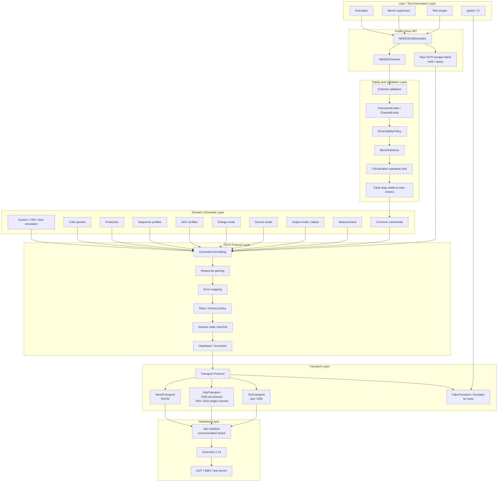

# Software Architecture Map

This document describes the intended architecture of the `ngi-n83624` Python driver package.
The driver is organised as a layered instrumentation library: user test scripts call a typed high-level API, the API validates and sequences commands safely, and a transport abstraction sends raw SCPI over TCP, UDP, or RS232.

## High-Level Architecture



## Package-Level Responsibility Map

```text
ngi_n83624/
├── __init__.py          Public exports and package version
├── driver.py            N83624CellSimulator, connection lifecycle, raw SCPI, heartbeat, reconnect
├── channel.py           N83624Channel high-level per-channel command API
├── transports.py        Transport Protocol, TCP, UDP, RS232 implementations
├── models.py            Enums, dataclasses, limits, retry policy, session state, measurement/status models
├── safety.py            Validation helpers, interlock interface, safe-operation policies
├── parsing.py           Numeric parsing, boolean parsing, response parsing utilities
├── exceptions.py        Typed exception hierarchy and vendor error-code mapping
├── commands.py          Shared SCPI command constants/helpers
├── logging_utils.py     Driver logging setup
└── emulator.py          Simple fake/emulated instrument for tests and examples
```

## Runtime Call Flow

Example: `ch1.configure_source(..., output=True)`

```text
User script
  ↓
N83624CellSimulator.tcp(...)
  ↓
N83624Channel.configure_source(...)
  ↓
Acquire full-duration instrument lock
  ↓
Validate channel number, units, limits, interlock, safety policy
  ↓
OUTPut1:ONOFF 0
OUTPut1:MODE 0
SOURce1:VOLTage <voltage>
SOURce1:OUTCURRent <current>
SOURce1:RANGe <range>
  ↓
Optional read-back verification
  ↓
If requested and allowed by safety policy/interlock:
OUTPut1:ONOFF 1
  ↓
Release lock
```

## Safety-Critical Locking Rule

The transport lock is not only for single `write()` or `query()` calls. It must be held for the entire duration of compound operations, including:

- configure-source / configure-charge / configure-SOC / configure-sequence command groups;
- write-then-readback verification;
- output-off-before-mode-change sequences;
- fault simulation settle-to-zero loops;
- reconnect state resynchronisation.

This prevents another thread from changing the same instrument state between safety-critical steps.

## UDP Architecture Rule

- UDP port `7000` represents the communication-board interface and may be used with the normal 24-channel API.
- UDP ports `7001` through `7024` are channel-specific fast-acquisition/control ports.
- A channel-specific UDP transport must be bound to exactly one `N83624Channel` context. The driver must reject calls to any other channel through that transport.

## Production Boundary

The driver is not a complete safety system. It must be integrated with external bench-level protections such as emergency stop, fusing, contactors, independent measurement, DUT-specific limits, and test-supervisor abort logic.
